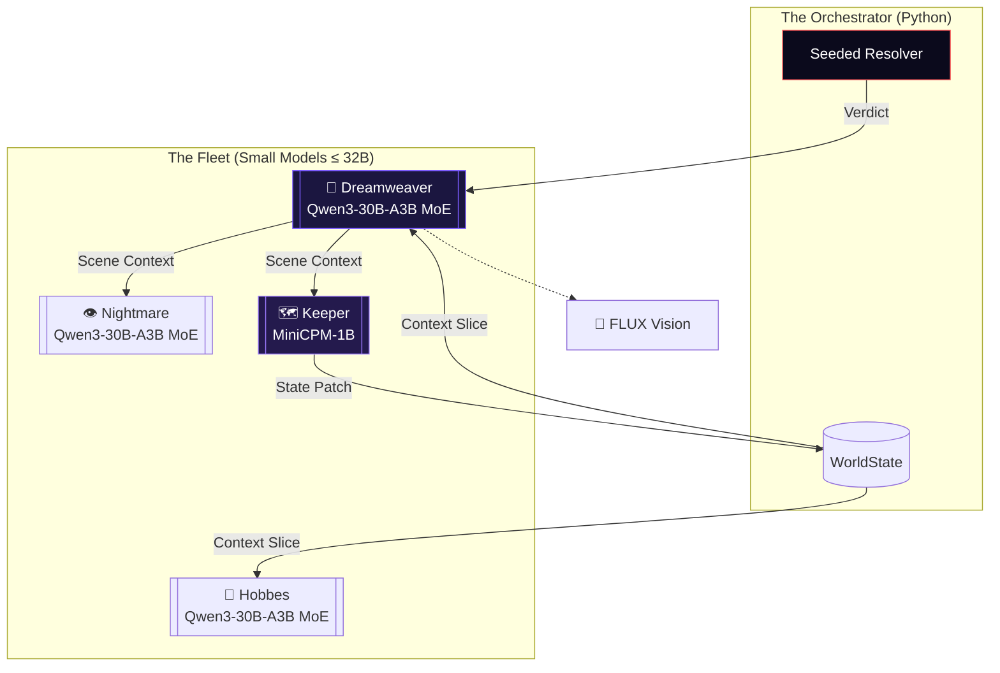
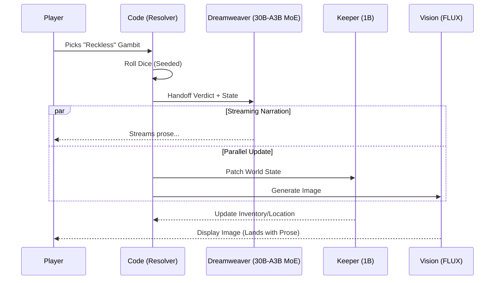

# 🌙 DAYDREAM — *Press Your Luck, Keep Your Tiger*

A bedtime dream you **play**, dreamed in real time by a **fleet of small models** — none
bigger than fits on one GPU. You take **gambits** (safe / bold / reckless) through
surreal worlds with your stuffed tiger **Hobbes**, who grows brave because of the bets
you take *together*. Code rolls the dice; the little models supply the soul.

> **The thesis — small models, big dreams.** You don't own one giant brain; you command
> a *fleet of scrappy small minds*. In a dream, a small model's fuzziness isn't a bug —
> it's the aesthetic. **The constraint is the art.** Every model ≤32B, by design.

---

## 🏆 Submission tags
- **Track:** *An Adventure in Thousand Token Wood* (whimsical) — there's even a `Thousand Token Wood` world inside.
- **Sponsor prizes:** **OpenBMB / Best MiniCPM** (MiniCPM5-1B is our Keeper) · **Modal / Best Use** (4 services + a cost-guardian).
- **Bonus badges:** **Best Agent** (a coordinated multi-agent fleet) · **Off Brand** (custom dream-deck UI + live generated visuals) · **Best Demo**.

## ✨ What makes it different

1. **A fleet, not a chatbot.** Four agents — 🌌 Dreamweaver, 👁 Nightmare, 🐯 Hobbes, 🗺 Keeper — each a small model with one job, coordinated per turn.
2. **Code owns the dice, models own the words.** Pass/fail and every reward is computed by a seeded, model-free resolver. The models *never* decide outcomes — so it's a **fair game**, not a story that flatters you. This is the heart of the design.
3. **Hobbes grows brave because of you.** A COURAGE meter rises when you survive bets made *with* him; his voice shifts cowering → steady → "I've got you." The "aww" is earned.
4. **The dream paints itself.** A FLUX image model renders each beat *in parallel under the narration*, so the picture lands as the prose finishes — same overlap trick we use for the state-keeper.
5. **Engineered for real Modal deployment.** Multi-backend (vLLM + llama.cpp + FLUX) plus a **cloud cost-guardian** we built after a runaway GPU lesson — scale-to-zero, hard container caps, and a lease-based dead-man's-switch.
6. **Deterministic & shareable.** Same dream seed replays the same dice *and* the same images → *"beat my run, seed `abc123`."*

---

## 🧠 The Fleet Architecture

DAYDREAM uses a **Distributed Fleet Architecture** to achieve coherence on models as small as 1B parameters.

### Agent Topology


### Turn Orchestration (Parallel Execution)


---

## 🎮 How it plays

1. Pick a world (Candy Desert, Sunken City, Rain Street, Red Planet, Thousand Token Wood) and a seed.
2. Take a **gambit** — 🟢 safe / 🟡 bold / 🔴 reckless — or type your own intent (a bold gamble).
3. The **Dreamweaver** narrates the outcome the dice already decided; the **Nightmare** presses when menace climbs; **Hobbes** reacts in his current mood and offers the next three gambits; the **Keeper** updates world-state.
4. Survive on **LUCIDITY**, climb **PROGRESS** to 100 to wake with the prize — and watch **COURAGE** turn Hobbes brave. Win or lose, the run freezes into a shareable Dream Journal.

## 🤖 The fleet
*Full design + diagrams: **[docs/ARCHITECTURE.md](docs/ARCHITECTURE.md)**.*

| Agent | Role | Backend (≤32B each) | Job |
|---|---|---|---|
| 🌌 Dreamweaver | specialist | Modal vLLM · Qwen3-30B-A3B (MoE, 3B active) | narrate the pre-decided outcome |
| 👁 Nightmare | specialist | Modal vLLM · Qwen3-30B-A3B (MoE, 3B active) | press the dread when menace is high |
| 🐯 Hobbes | specialist | Modal vLLM · Qwen3-30B-A3B (MoE, 3B active) | companion; voice keyed to COURAGE; offer gambits |
| 🗺 Keeper | router | Modal llama.cpp · **MiniCPM5-1B** | structured world-state (location, items, memory) |
| 🎨 dream image | vision | Modal · FLUX.1-schnell | paint each beat, in parallel under the narration |

Backends are OpenAI-compatible → swap models or run "off the grid" via one env var, no code change.

## 🧠 Why it stays coherent on small models
The **world-state lives in code**, outside the models (`agents/world.py`). Each turn the engine
feeds each agent a compact slice of truth, so a 1B router can keep a consistent world that a
single small context never could. The **resolver** (`agents/resolver.py`) owns all game math,
seeded by `(seed, turn)` — fair, replayable, and impossible for a model to fudge.

## ☁️ Best Use of Modal — and a cost story
DAYDREAM runs **four Modal services** (vLLM, llama.cpp, FLUX, and a guardian). After a
keep-warm GPU once cold-looped and burned real money, we made cost control *structural*:
- **Scale-to-zero + `max_containers=1`** on every GPU app — $0 idle, no fan-out.
- A **cloud guardian**: a cheap cron that warm-pings endpoints **only while a time-boxed lease is active** — so warmth is a *pull*, not a pin. Forget to tear down? The lease expires and everything scales to zero on its own, independent of your laptop.
- A `make` control surface: `make status` (apps + lease + live spend tracker), `make stop` (panic), `make demo-up/down`.

All endpoint URLs derive from one `MODAL_WORKSPACE` slug, so moving workspaces is a one-line change.

## 🚀 Run it
**Offline (no backend, fully playable):**
```bash
python -m venv .venv && source .venv/bin/activate
pip install -r requirements.txt
DAYDREAM_MOCK=1 python app/app.py
```
**Against Modal inference:** set `MODAL_WORKSPACE` + keys in `.env` (see `.env.example`), then `make deploy && python app/app.py`.

## 🗂 Layout
| Path | What |
|---|---|
| `agents/dream.py` | the fleet engine (Dreamweaver · Nightmare · Hobbes · Keeper) |
| `agents/resolver.py` | seeded, model-free dice + reward math (code owns the game) |
| `agents/world.py` | environments + externalized `WorldState` |
| `agents/vision.py` | per-beat dream-image prompts + FLUX client |
| `agents/base.py` | tiny streaming/JSON Agent + `DAYDREAM_MOCK` offline mode |
| `app/app.py` | Gradio dream-deck UI |
| `modal_app/*.py` | Modal vLLM · llama.cpp · FLUX · guardian |

*Small models, big dreams.* 🌙
