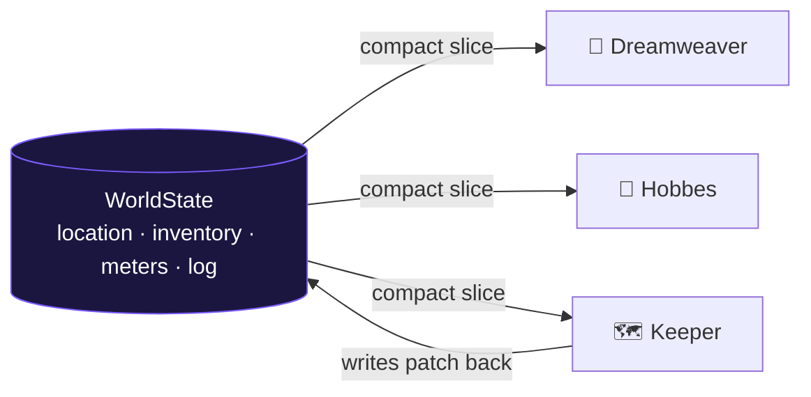
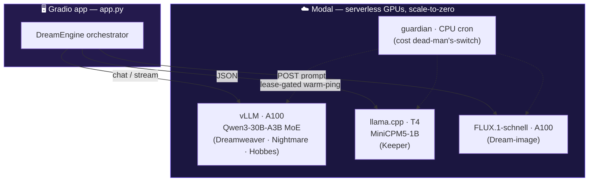

# 🌙 DAYDREAM — Multi-Agent Architecture

> **Thesis:** you don't run one big brain — you conduct a *fleet of small, specialized
> minds*. Each agent is a sub-32B model with exactly one job. Code holds the truth and
> rolls the dice; the models only ever supply **words and voice**. *Small models, big dreams.*

---

## The fleet at a glance

| Agent | Job | Output | Backend (≤32B each) |
|---|---|---|---|
| 🌌 **Dreamweaver** | narrate the outcome the dice already decided | streamed prose | vLLM · Qwen3-30B-A3B (MoE: 30B total / 3B active) |
| 👁 **Nightmare** | press the dread when menace is high | one ominous line | vLLM · same specialist |
| 🐯 **Hobbes** | companion; voice keyed to COURAGE; offer 3 gambits | JSON `{reaction, choices}` | vLLM · same specialist |
| 🗺 **Keeper** | track world-state (location, items, memory) | JSON state patch | llama.cpp · **MiniCPM5-1B** |
| 🎨 **Dream-image** | paint each beat | PNG | FLUX.1-schnell |

A **deterministic, model-free `resolver`** owns every dice roll and reward — so outcomes are
*fair and replayable*, never decided by an LLM.

---

## One turn, end to end

```mermaid
flowchart TD
    P([Player picks a gambit:<br/>🟢 safe / 🟡 bold / 🔴 reckless]) --> R

    subgraph CODE["⚙️ CODE — owns the truth & the dice"]
        R[resolver.resolve<br/>seeded by &#40;seed, turn&#41;<br/>→ success / partial / fail]
        AP[apply&#40;outcome&#41;<br/>move LUCIDITY · PROGRESS<br/>· COURAGE · MENACE]
        WS[(WorldState<br/>externalized truth)]
    end

    subgraph FLEET["🤖 SMALL-MODEL FLEET — owns words & voice"]
        DW[🌌 Dreamweaver<br/>narrate the verdict]
        NM[👁 Nightmare<br/>press the menace]
        HB[🐯 Hobbes<br/>react + 3 gambits]
        KP[🗺 Keeper<br/>state patch]
        IMG[🎨 Dream-image<br/>paint the beat]
    end

    R --> AP --> WS
    R -->|verdict + state slice| DW
    DW -->|scene| NM
    DW -->|scene| HB
    DW -.runs in parallel.-> IMG
    DW -.runs in parallel.-> KP
    HB -->|3 labels zipped onto<br/>code-fixed tiers| OUT([Next 3 gambit buttons])
    KP --> WS
    IMG --> SCREEN([🖼️ dream image])
    DW --> SCREEN2([📜 streamed narration])

    style CODE fill:#1b1640,stroke:#7c5cff,color:#fff
    style FLEET fill:#241a4d,stroke:#9d7bff,color:#fff
```

**Read it as:** the dice land first (code), then the fleet dresses that pre-decided
outcome in language — and the Keeper + image are painted *concurrently underneath* the
narration, so they cost ~no extra wall-clock.

---

## Two principles that make small models work

### 1. Code owns the dice, models own the words
The model must **never** decide whether a gamble succeeds — or the roguelike isn't fair and
the "why small models" story is decorative. `resolver.py` computes pass/fail and every reward
from a **seeded RNG keyed to `(seed, turn)`**. Same seed → same dice → *"beat my run, seed
abc123"* is honest. The Dreamweaver only writes the *flavor* of an outcome already chosen.

### 2. The world-state lives outside the models
Small models can't hold a long coherent context. So the source of truth is an externalized
`WorldState` (`world.py`); each turn the engine feeds every agent a **compact slice** of it.
A 1B router can keep a consistent world that a single small context never could.

---

## Backend topology — the right model for each job

- **Heavy lifting → vLLM/MoE specialist:** prose + voice need the bigger model, but the MoE
  fires only ~3B params per token, so it's a *fleet within a fleet* — fast *and* rich.
- **Structured state → tiny MiniCPM router:** JSON patches are cheap; a 1B model is plenty,
  and routes the OpenBMB story.
- **Vision → FLUX:** paints the beat in parallel under the narration.
- **Cost guardian:** GPUs are always scale-to-zero; a CPU cron keeps them warm *only while a
  time-boxed lease is active*, so a forgotten demo can't run up a bill.

---

## Why this is genuinely "multi-agent" (not a prompt chain)
- **Distinct models on distinct hardware**, each with its own persona, sampling config, and contract.
- **Heterogeneous outputs** — streamed prose, structured JSON, and an image — fused into one turn.
- **Orchestration with real control flow:** the Nightmare only speaks when menace is high; Hobbes'
  voice is gated by the COURAGE meter; the Keeper and image run concurrently.
- **A code referee** the agents can't override — the part that makes it a *game*, not a chatbot.

*See [`agents/dream.py`](../agents/dream.py) for the engine, [`agents/resolver.py`](../agents/resolver.py)
for the dice, and [`agents/world.py`](../agents/world.py) for the externalized state.*
